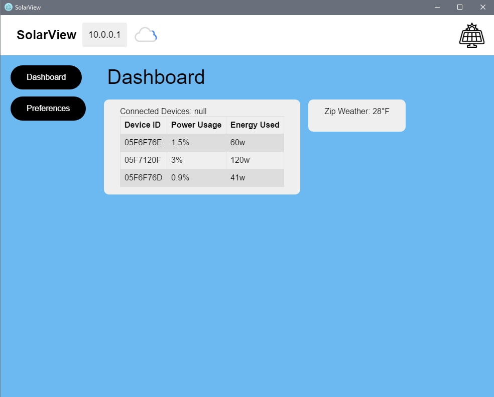
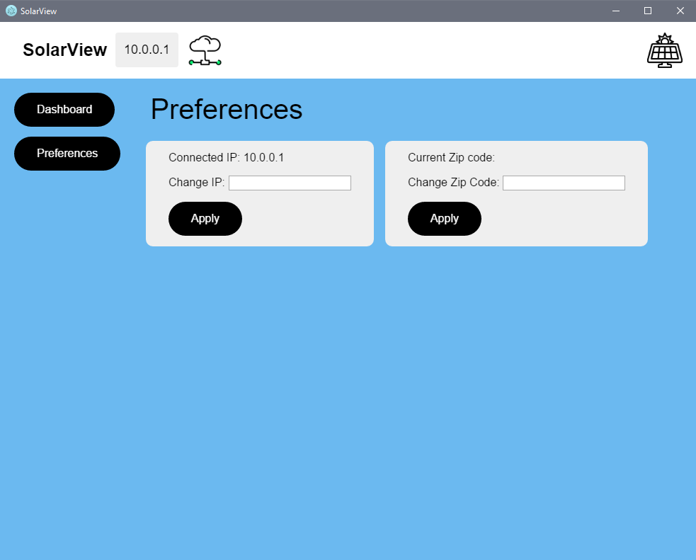

# SolarView 

**Status:** Alpha v 1.0.2


**What is it?**
This is software for Enecsys Solar Panels Inverters. It is the better alternative compared to ALL other competitors.
It is free to use, and all license are registered to Bart Tarasewicz.

**How to install**

**Step 1.** Open cmd or git console and enter the following: 
```
git clone https://github.com/bartektenDev/SolarView.git
sudo npm install
```

If you run into any errors from running (sudo npm install) then run the following to fix errors
```
sudo npm audit fix
```

**Step 2.** Open the SolarView folder and open cmd or git console there. Then enter the following:
```
npm start
```

**Step 3.** Software should have launched! Go to preferences and enter the IP of the solar panels box! Click apply and enjoy! There's also additional features so check those out too.

**UI Design**




